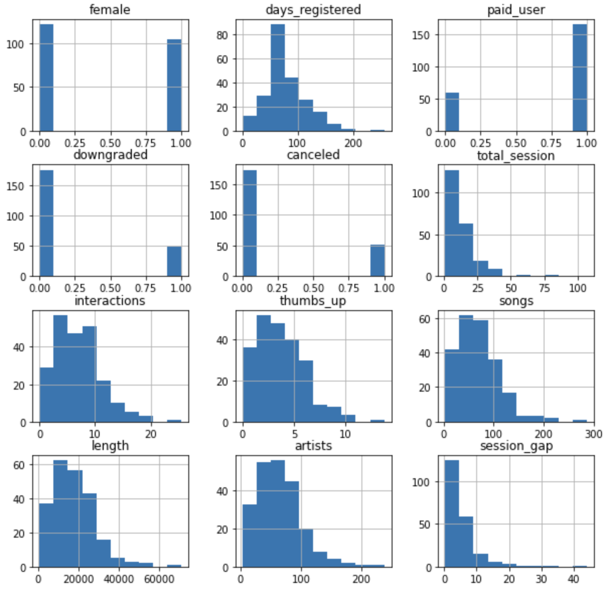

# BDA project - Sparkify

- **Student:** Alessio Cocchieri
- **Matricola:** 0001046067
- **Email:** alessio.cocchieri2@studio.unibo.it

# Apache Spark Cluster on Docker
This project is executed in Apache Spark cluster mode with a JupyterLab interface built on top of Docker.

<p align="center">
  
</p>


## Cluster overview 
| Application              | URL | Description  |
|-------------------|----|----|
| JuyterLab | localhost:8888| Cluster interface with built-in Jupyter notebooks | 
| Spark Driver | localhost:4040| Spark Driver web ui | 
| Spark Master | localhost:8080| Spark Master node | 
| Spark Worker | localhost:8081| Spark Worker node with 2 core and 5GB of memory (default)| 
| Spark Worker | localhost:8082| Spark Worker node with 2 core and 5GB of memory (default)| 

## Cluster execution
1. Install *Docker* and *Docker Compose*
2. Download the docker-compose file
3. Edit the file with the preferred setup
4. Run the cluster: <code> docker-compose up </code>
5. Run the following command inside the notebook:
```
from pyspark.sql import SparkSession

spark = SparkSession.\
        builder.\
        appName("sparkify").\
        master("spark://spark-master:7077").\
        config("spark.executor.memory", "5120m").\
        getOrCreate()
```
# Dataset
The dataset consists of **286500 patterns** and **18 features** related to typical user activity on Sparkify platform.
Sparkify is a music streaming service. Just like other famous streaming services (e.g. Spotify), users can choose free tier subscription with ads or paid tier without ads. They are free to upgrade, downgrade, or cancel their subscription plan.

The dataset can be downloaded at the following link: 
https://drive.google.com/file/d/1HidalTO6cNEhaCS-JGrAQLquU01WGJPF/view?usp=share_link

# Task
The task consists of a binary classification problem where in this case the objective is to identify clients more likely to churn. If we can identify which users are at-risk to churn, then the business can take action and potentially make them stay.

# Data overview 
The main issue of the current task is related to the high imbalanced class ratio. From the data it is possible to identify 225 **distinct users**. As shown in the figure below, the positive class (churn) is only about 23% of the total data points. 

<p align="center">
  
</p>

# Evaluation metric
Because of the high imbalanced class ratio in the data, *accuracy* is inappropriate as evaluation metric. The main reason is that the overwhelming number of examples from the majority class will overwhelm the number of examples in the minority class, meaning that even unskillful models can achieve accuracy scores of 90 percent, or 99 percent, depending on how severe the class imbalance happens to be.

An alternative to using classification accuracy is to use precision and recall metrics:
- Precision quantifies the number of positive class predictions that actually belong to the positive class.
- Recall quantifies the number of positive class predictions made out of all positive examples in the dataset.
- F1-score provides a single score that balances both the concerns of precision and recall in one number.

Since our goal is to predict the users more likely to churn (postive class), **F1-score of positive class** has been considerend as main reference to select the best model for the current problem. 

At the same time also AUC-PR turned out to be good indicator to evaluate the performances of the models. When working with imbalanced datasets in binary classification problems, it's often more appropriate to use the AUC-PR as a performance metric rather than the AUC-ROC. It provides a more accurate representation of the model's ability to correctly classify the minority class.

# Feature analysis
The 18 features can be divided into 3 different levels:

1. User-level information
    - `userId (string)`: user’s id
    - `firstName (string)`: user’s first name
    - `lastName (string)`: user’s last name
    - `gender (string)`: user’s gender, 2 categories (M and F)
    - `location (string)`: user’s location
    - `userAgent (string)`: agent (browser) used by the user
    - `registration (int)`: user’s registration timestamp
    - `level (string)`: subscription level, 2 categories (free and paid)

2. Log-specific information
    - `ts (int)`: timestamp of the log
    - `page (string)`: type of interaction associated with the page (NextSong, Home, Login, Cancellation Confirmation, etc.)
    - `auth (string)`: authentication level, 4 categories (Logged In, Logged Out, Cancelled, Guest)
    - `sessionId (int)`: a session id
    - `itemInSession (int)`: log count in the session
    - `method (string)`: HTTP request method, 2 categories (GET and PUT)
    - `status (int)`: HTTP status code, 3 categories (200, 307 and 404)

3. Song-level information
    - `song (string)`: song name
    - `artist (string)`: artist name
    - `length (double)`: song’s length in seconds

# Data preprocessing
The first step of our analysis consists of preprocessing the data: 
- Map the target class: not churn --> 0 and churn --> 1
- Map the gender: Male --> 0, Female --> 1
- Convert time stamp format to date time format
- Check for nulls

# Exploratory Data Analysis (EDA)
EDA was used to analyze and investigate the data and summarize its main characteristics. It helps determine how best to manipulate data sources to get the answers we need. The most interesting insights discovered are the following: 
- In addition to playing music, *Thumbs Up* and *Add to playlist* turned out to be the activities most performed by the users
- The are more male users than female users
- Most common location are Los Angeles and New York
- Premium users are more prone to churn
- The date range in the dataset is 2018-09-30 to 2018-12-02. We can see paid tier and free tier has similar numbers of user sessions and distinct user at the beginning, then both metrics increased over time for the paid tier as the metrics decreased for free users.
- Most churns happens within 100 days after registration.

# Features engineering
It is the most crucial step in the current task. The initial 18 features provided by the dataset need to be transformed to be actually useful for our task. Feature engineering is the process of using domain knowledge to extract features (characteristics, properties, attributes) from raw data. 
Based on the analysis carried out still now thanks to EDA, we are ready to extract the features that actually will allow us to understand clients more prone to churn.

In this regards, I decided to extract the following 11 features:
- `gender`: male or female
- `days_registered`: number of days the user is registered
- `paid_user`: free account or premium account
- `downgraded`: has the user ever downgraded from premium to free?
- `artists`: average number of artits listened per session by the user
- `songs`: average number of songs listened per session by the user 
- `length`: average second listened of songs per session by the user
- `interactions`: average proactive operations performed by the user per session 
- `thumbs_down`: average thumbs down released by the user per session
- `total_session`: total number of session 
- `session_gap`: average time between each session and the pevious one

# Features distribution
The distibution of the extracted features is shown in the figure below:
<p align="center">
  
</p>

# Correlation between features (Feature selection)
Another relevant point which could affect the classification performances is the correlation among features: the presence of strongly correlated features may lead to a decline in the performances of some classification algorithms which assume that the predictors are all independent. Another benefit from spotting correlation among features is that the same information may be encoded with less attributes, and this could lead to simpler final models. The reduction of the dimensions of the feature vectors can make the model more trustable and stable, if the discarded dimensions don’t affect significantly the total original information.

In this case, Pearson correlation has been considered. It ranges from -1 to 1, with -1 indicating a strong negative linear relationship, 0 indicating no linear relationship, and 1 indicating a strong positive linear relationship.
The following representation shows the correlation matrix between features: since the way the matrix is constructed make it symmetric and because of the large number of features, only the heatmap of the lower diagonal matrix (the diagonal itself is excluded) is reported for a better visualization.

<p align="center">
  
</p>


There is no obvious strong predictor for `cancelled` except for `user_age`

`songs`, `interactions`, `thumbs_up`, `length`, `artists` are very similar according to the histograms. Although they all show high correlation with each other, this is possibly caused by the small dataset (225 users). If we have more data, we might see more variance in user behaviors. Therefore, we will **only exclude songs and artists** as they will always be similar to length.

To give a further proof of the linear dependence among `length`, `artist` and `songs`, their interactions plots are shown:
<p align="center">
  
</p>

For completness, also charts of non-strongly correlated features are reported. In particular:
- ***interactions*** and ***total_session*** $p$ = 0.07
- ***interactions*** and ***session_gap*** $p$ = -0.17
- ***days_registered*** and ***total_session*** $p$ = 0.20

<p align="center">
  
</p>


# Outliers removal
There is a particular category of users to consider before making inference: the users whose total session is equal to 1. They are probably new users just entered in the application and their session_gap is indeed equal to NaN.  However, here we are trying to predict people who used to be an active user but decides to leave. For this reason, they are out of the scope of our analysis and we will exclude them from the prediction.

# Features preparation
Features must be prepared in the right way in order to be fed to the model. In this regards, a couple of futher steps are needed:

- **Assembling**: for each reacord, its features must be assembled in a unique array. Pyspark provides the function VectorAssembler() which takes as input the features selected and the name of the column which will contain their assembling. Indeed, the function creates an array which aggregates all the features toghether.

- **Scaling**: After being assembled, the features must be scaled by exploiting the function StandardScaler(). The purpose of Standard Scaler is to transform the features so that they have a Gaussian distribution with zero mean and unit variance. This can help the model to achieve better performance by normalizing the scale of the features

# Split train and test set
```
# Split train/test data and set seed for reproducibility
train, test = data.randomSplit([0.75, 0.25], seed=42)
```
The split has been randomly generated but kept the same for all the tested approaches, in order to make evaluations statistically meaningful and provide consistent results among the different classifiers. This has been obtained by setting the random seed = 42. This specific seed allowed also to maintain the proportion of churn/non-churn clients in each of the final sets approximately the same as in the initial data. This approach is desirable every time we have a highly unbalanced dataset as in our case.

# Model fine-tuning
To find the best model and parameters, we use CrossValidator to evaluate the model performance and validate the robustness of the models. With numFolds = 3 , the CrossValidator generates 3 sets of training/testing pairs, each of which uses 2/3 of the data for training and 1/3 for testing. To evaluate a particular model/param selection, CrossValidator computes the average evaluation metrics for the 3 models fitted on the 3 train/test pairs.

Since our objective is to maximize the ability of the model to predict users more likely to churn, I decided to define a custom evaluator which consider as reference metric only the F1 score of the positive class 1(churn). To do so, it is necessary to extend the MulticlassClassificationEvaluator class and override the evaluate method.

```
class F1PositiveEvaluator(MulticlassClassificationEvaluator):

    def __init__(self, predictionCol="prediction", labelCol="label"):
        super(F1PositiveEvaluator, self).__init__(predictionCol=predictionCol, labelCol=labelCol)

    def evaluate(self, dataset):
        predictionAndLabels = dataset.select(self.getPredictionCol(), self.getLabelCol()).rdd.map(lambda lp: (float(lp[0]), float(lp[1])))
        metrics = MulticlassMetrics(predictionAndLabels)
        return metrics.fMeasure(1.0)
```

# Models selection
I decided to compare the performances of 4 different models:

- Logistic Regression
- Random Forest Classifier
- SVM (linear kernel)
- GBT Classifier

## Logistic regression 
Logistic Regression is a statistical method that is commonly used for binary classification. It is a simple and easy to interpret model, which outputs a probability between 0 and 1 that represents the likelihood of the positive class. The coefficients of the model represent the contribution of each feature to the predicted probability.

These are the results obtained by the model:
```
Precision: 0.8518518518518519
Recall: 0.6571428571428571
F1 positive class: 0.7419354838709677
F1 macro: 0.8413381123058542
AUC-PR: 0.7419646841333589 

TEST results:
Precision: 1.0
Recall: 0.5454545454545454
F1 positive class: 0.7058823529411764
F1 macro: 0.8177299088649543
AUC-PR: 0.8295454545454546
```

### Coefficients
In logistic regression for binary classification, the coefficients represent the change in the log odds of the dependent variable (the binary outcome) for a one unit change in the independent variable, while holding all other variables constant.

- session_gap, total_sessiom and interactions are inversely correlated with the probability of churn, so the higher their value, the less the probability of the client to churn
- On the other hand, the length and the typology of the user turned out to be features directly correlated with the probability of being a churn.

<p align="center">
  
</p>

## Random Forest
Random Forest is a powerful algorithm that can achieve high performances in binary classification problems by combining the predictions of many decision trees. The combination of trees helps to reduce overfitting and improve the generalization ability of the model.
It provides feature importance scores, which can be used to identify the most important features in the data and help to improve the interpretability of the model. 


These are the results obtained by the model:
```
TRAIN results:
Precision: 1.0
Recall: 0.6857142857142857
F1 positive class: 0.8135593220338984
F1 macro: 0.8866331408704291
AUC-PR: 0.8759896729776248 

TEST results:
Precision: 0.8
Recall: 0.36363636363636365
F1 positive class: 0.5000000000000001
F1 macro: 0.6944444444444444
AUC-PR: 0.625 
```
The model shows high overfitting and in general the perfomances are much worse than logistic regression. This can be justified by the fact that Random Forest is more suitable for much larger dataset where the relationship between the features and target variable is complex.  

### Feature importance
In a Random Forest Classifier, feature importance is a measure of the contribution of each feature to the prediction accuracy of the model. From the plot we can see as paid_user and downgraded are the feature with the least impact on churn prediction, while days_registered and session_gap turned out to be the most important.

<p align="center">
  
</p>

## SVM (linear kernel)
As happens for Logistic Regression, this method is useful in binary classification because Linear SVC models the relationship between the features and the target variable as a linear boundary, which makes it easy to visualize and interpret the relationship.

In the Support Vector Classification (SVC) algorithm, the coefficients do not have an direct interpretation in the same way that they do in logistic regression. In SVC, the goal is to find the best boundary (or hyperplane) that separates the data into two classes. The coefficients in an SVC model represent the weights assigned to each feature in determining the position of this boundary.


These are the results obtained by the model:
```
TRAIN results:
Precision: 0.9090909090909091
Recall: 0.2857142857142857
F1 positive class: 0.43478260869565216
F1 macro: 0.6719367588932806
AUC-PR: 0.6597167892348615 

TEST results:
Precision: 1.0
Recall: 0.2727272727272727
F1 positive class: 0.42857142857142855
F1 macro: 0.6602316602316602
AUC-PR: 0.7272727272727273 
```
The model does not seem to work well with a F1 score of only about 43% for the positive class.

### Coefficients
`session_gap` and `total_session` have the highest impact are the most important features in determining the boundary.
<p align="center">
  
</p>

# GBT classifier
Gradient Boosting Tree (GBT) classifier is an ensemble machine learning algorithm. As happens for Random Forest, it models non-linear relationships, handles large datasets efficiently and provides the feature importance scores. However, GBT classifier is generally considered more complex and slower to train respect to Random Forest because it builds the trees sequentially, whereas Random Forest builds the trees in parallel.

These are the results obtained by the model:
```
TRAIN results:
Precision: 0.92
Recall: 0.6571428571428571
F1 positive class: 0.7666666666666667
F1 macro: 0.8575980392156863
AUC-PR: 0.7984302925989674 

TEST results:
Precision: 0.8
Recall: 0.36363636363636365
F1 positive class: 0.5000000000000001
F1 macro: 0.6944444444444444
AUC-PR: 0.625 
```
As Random Forest, GBT shows high overfitting. 

### Feature importance
As we can see by the plot, GBT does not make use of `paid_user` to predict the target. 
<p align="center">
  
</p>

# Handling imbalanced class ratio to improve the results
Handling imbalanced datasets is a common challenge in machine learning. When dealing with significantly unbalanced dataset in the target label, it becomes harder for most machine learning algorithms to efficiently learn all classes. The training process might be indeed biased towards a certain class if the dataset distribution is poorly balanced.

In this specific case, only about 23.11% of the data are labelled as churn (label=1).

There are several ways to address this issue with PySpark. We will focus on the following two approaches:

- Resempling
- Weighting

## Resampling
While the obvious and most desirable solution would be to collect more real data, oversampling and undersampling are techniques that may still come in handy in these situations. For both techniques there is a naive approach that is the random oversampling (undersampling) where training data is incremented (decremented) with multiple copies of the samples, until the same proportion is obtained on the minority (majority) classes. A more sophisticated approach is SMOTE oversampling which works by utilizing a k-nearest neighbour algorithm to create synthetic data from the minority class.

Random oversampling simply duplicates existing minority class samples to increase their count, whereas SMOTE synthesizes new samples of the minority class based on the existing samples. The advantage of SMOTE over random oversampling is that it generates synthetic samples that are similar to the existing minority class samples, which helps to preserve the underlying structure of the minority class. This can improve the performance of machine learning algorithms compared to random oversampling, which can lead to overfitting if the minority class is simply duplicated multiple times.

An important reminder is to always split into test and train sets BEFORE trying oversampling techniques. Oversampling before splitting the data can allow the exact same observations to be present in both the test and train sets. This can allow our model to simply memorize specific data points and cause overfitting and poor generalization to the test data.

## Weighting
The samples from the minority class can be weighted more heavily to balance the contribution of each class in the training process.
In some cases, reweighting the dataset may provide better results than resampling techniques because it does not change the distribution of the samples in the original dataset, and it allows the model to see the true distribution of the classes.

In PySpark, you can reweight the datasets for imbalanced binary classification by adjusting the class weights in the loss function used in the machine learning algorithm. This will make the model pay more attention to the minority class samples and help to balance the class distribution. The `setClassWeight` method is used to set the class weights in each model.
```
lr_weight = LogisticRegression(maxIter=10, elasticNetParam=1.0, regParam = 0.0001)
lr_weight.setWeightCol('classWeightCol')
```

## Result after handling imbalanced classes (F1 positive class on test set)
| MODEL               | Baseline | Downsampling  | Upsampling | SMOTE | Weighting|
|-------------------|----|----|---------|----------|----------|
| Logistic Regression (LR) | 0.71| 0.70 | 0.74      | 0.76       | 0.80|
| Random Forest (RF) | 0.50|0.56 | 0.59      | 0.63       | 0.53|
| SVM | 0.42|0.69 | 0.70      | 0.73      | 0.74|
| GBT | 0.50|0.48 | 0.63      | 0.63      | 0.59|

## Overall results
Below it is possible to see all the results obtained in all the experiments per each model.

| MODEL             |  F1 | F1_macro  | Precision | Recall   | 
|-------------------|-----|-----------|-----------|----------|
| LR                | 0.71| 0.82      | 1.0       | 0.54     | 
| LR + downsampling | 0.69| 0.79      | 0.67      | 0.73     | 
| LR + upsampling   | 0.74| 0.83      | 0.87      | 0.64     |  
| LR + SMOTE        | 0.76| 0.84      | 0.80      | 0.72     |
| LR + weighting    | 0.80| 0.87      | 0.88      | 0.73     |

| MODEL             |  F1 | F1_macro  | Precision | Recall   |
|-------------------|-----|-----------|-----------|----------|
| RF                | 0.50| 0.70      | 0.80      | 0.36     | 
| RF + downsampling | 0.56| 0.69      | 0.50      | 0.64     | 
| RF + upsampling   | 0.59| 0.74      | 0.83      | 0.45     | 
| RF + SMOTE        | 0.62| 0.77      | 1.0       | 0.45     | 
| RF + weighting    | 0.53| 0.71      | 1.0       | 0.36     |

| MODEL              |  F1 | F1_macro  | Precision | Recall   |
|--------------------|-----|-----------|-----------|----------|
| SVM                | 0.42| 0.66      | 1.0       | 0.27     | 
| SVM + downsampling | 0.69| 0.79      | 0.67      | 0.73     | 
| SVM + upsampling   | 0.70| 0.81      | 0.78      | 0.63     | 
| SVM + SMOTE        | 0.73| 0.82      | 0.73      | 0.73     | 
| SVM + weighting    | 0.74| 0.83      | 0.88      | 0.63     |

| MODEL              |  F1 | F1_macro  | Precision | Recall   |
|--------------------|-----|-----------|-----------|----------|
| GBT                | 0.50| 0.69      | 0.80      | 0.36     | 
| GBT + downsampling | 0.48| 0.59      | 0.36      | 0.72     | 
| GBT + upsampling   | 0.63| 0.77      | 0.75      | 0.55     | 
| GBT + SMOTE        | 0.63| 0.77      | 0.75      | 0.55     | 
| GBT + weighting    | 0.59| 0.74      | 0.83      | 0.45     |

# Conclusion
The study carried out so far has higlighted important aspects:
- Logistic regression model with class weights has the strongest predicting power with 80% f1-score for the postive class, and with a precision of 88% and a recall of 72%. 

- Features engineering and features selection were the most crucial phases of the project: from the 18 original fields, we selected only the relevant measures to user behavior and created 11 features. Then we further trimmed the data down to 9 feature with unique characteristics based on their correlations to train the models.

- Cleaning and wrangling the data properly not only improves the model performance, but also make the pipeline more operational efficient and scalable. For Sparkify mini data, we aggregated 268k event-level records to 225 user-level records, which is 0.1% size of the raw data.

- RF and GBT suffered the most the low amount of data available by showing high overfitting.

- Upsampling methods turned out to be the best choices for RF and GBT in order to improve their performances. In particular SMOTE allowed RF and GBT to increase its F1 score up to 62% and 63% respectively.

- Both weighting and resempling were crucial for the perfomances of SVM model.  

# Main challenges encountered
- Imbalanced class ratio
- Seasonality: The data we are using only contains two months of data, which means the analysis could be biased by seasonality.
- Small dataset: too small number of train samples

# Future works
- Test the models with the greater version of the dataset (12GB). Probably RF and GBT would show intersting improvements in their performance due to the higher amount of data at disposal.
- Better hyperparameters tuning
- Better feature exctraction: with higher amount of data at disposal, a greater number of features would be necessary. 


